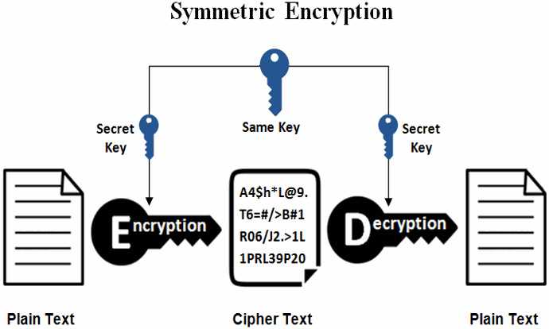
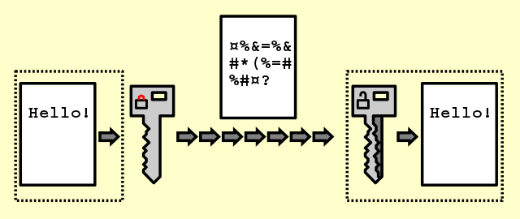
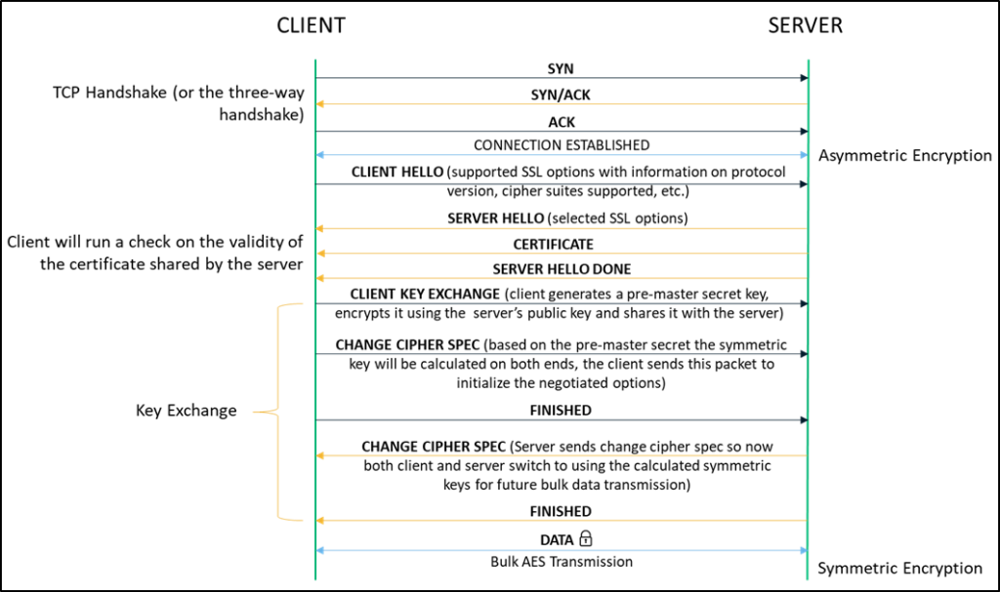

# Encryption

## Todays topics

Hey, check out these slides...

* What is ***encryption***
* What is a ***cryptosystem***
* Types of encryption
  * Symmetric encryption
  * Asymmetric encryption
* Public and Private keys
* Key Exchanges

---

# What is Encryption


***Encryption*** is the process of *encoding* information with a purpose (typically for security security).  This process converts the original representation of the information, known as *plaintext*, into an alternative form known as *ciphertext*.

This process, combined with its reverse *decryption*, and all of the data/algorithms necessary to encrypt and decrypt messages form a *cryptosystem*.

> -Wikipedia

---

# [Encoding and Encrpytion](https://medium.com/practicum-by-yandex/what-is-the-difference-between-encoding-and-encryption-5e509c9a33fc)

---

{height=50%}

---

# What is Encryption (continued)

Some points:

* Encryption is reversible (with a key)
* Encryption is everywhere
* Encryption does NOT need a computer (but good encryption probably does...)

---

# Cryptosystem

Five-tuple (sequence) of the following elements:

Element | description
 ---    | ---
***E*** | the set of ***Encryption*** algorithms
***D*** | the set of ***Decryption*** algorithms
***M*** | the set of plaintext ***Messages*** 
***K*** | the set of ***Keys*** 
***C*** | the set of encrypted messages or ***Ciphertexts*** 

***E*** = *f(* ***K***,***M*** *)* -> ***C***
 
***D*** = *f(* ***K***,***C*** *)* -> ***M*** 

---

# Scytale Cryptosystem

Element | description
 ---    | ---
***E*** | wrap around scytale & write *message*
***D*** | wrap around scytale & read *message*
***M*** | the *message*
***K*** | ???
***C*** | strip or paper with letters

---

# Caesar Cipher

AKA rotational cipher, shift cipher, probably more.  Simple encryption via substitution.

{height=75%}


---

# Lets get Math-y

::: columns

:::: column

Element | description
 ---    | ---
***M*** | ***? ?? ????*** 
***C*** | ***F XJ EBOB***
***E*** | ***C***\[n\]=(***M***\[n\] - 3 ) Mod 26
***D*** | ***M***\[n\]=(***C***\[n\] + 3 ) Mod 26
***K*** | What is the key?

::::

:::: {.column width=20%}


::::

:::

```
M[n] = ABCDEFGHIJKLMNOPQRSTUVWXYZ
C[n] = XYZABCDEFGHIJKLMNOPQRSTUVW
```

---

# Two types of Encryption

## Symmetric

Same key for both encrypting and decrypting

## Asymmetric

Different keys for encrypting and decrypting

--- 

# Symmetric Encryption



Keys are identical for encryption and decryption.

---

# Asymmetric Encryption



Keys are different but mathematically related.

---

# Differences

Symmetric | Asymmetric
---       | ---
* One key | * Multiple keys
* Fast | * Slow
* Used to encrypt various amounts of data | * Used to authenticate and initiate symmetric encryption
* Key must be secured | * only private key needs securing
* Needs more keys to establish secure communications within a group | * Needs fewer keys to establish secure communication in a group

---

# Public and Private Key pairs

* Public key is public information, can be shared with anyone.
* Assume **everyone** has your public key
* Private key must be kept private
* **Public** and **Private** key pairs share a unique mathematical relation:
  * Anything **encrypted** with the **public key** can only be *decrypted* with the *private key*
  * Anything **encrypted** with the **private key** can only be *decrypted* with the *public key*

---

# Key Pairs continued

If we trust this relationship, and we trust that recorded knowledge of who has what keys:

* We can check *Authenticity* by asking them to encrypt something with their private key
* We can recieve (one way) secure communications (ask someone else to first encrypt with your public key)
* If we send something encrypted with our private key who can read it???

---

# Diffie-Hellman Key Exchange

Solves the problem of securely exchanging cryptographic keys over a public channel.

* The internet is public and filled with many potential eavsdroppers (***Eve's***)
* {height=25%}
* How to establish a *secure* communication channel across an insecure one?

---

# Diffie-Hellmen

{height=90%}

---

# Diffie-Hellman w/colors

{height=90%}

---

# Diffie-Hellman usage

HTTPS://



---


[Figure 2]: https://wizardforcel.gitbooks.io/practical-cryptography-for-developers-book/content/encryption-symmetric-and-asymmetric.html

[By Johannes Landin - Vectorized version of File:Public_key_encryption_keys.png, CC BY-SA 3.0]: https://commons.wikimedia.org/w/index.php?curid=95527624

[By A.J. Han Vinck, University of Duisburg-EssenSVG version: Flugaal - A.J. Han Vinck, Introduction to public key cryptography, p. 16, Public Domain]: https://commons.wikimedia.org/w/index.php?curid=17063048


