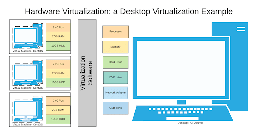
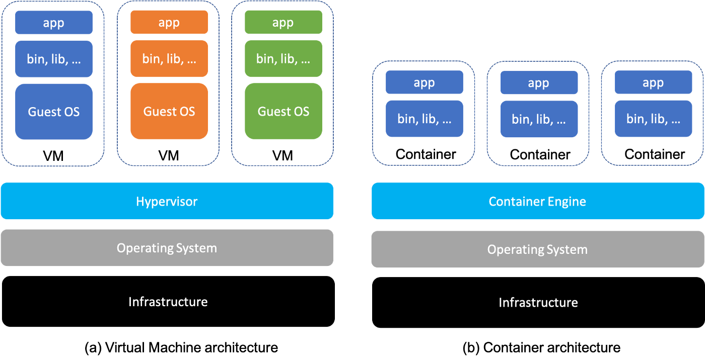

# Virtualization

* Virtualization
* Containers/sandboxes
* Cloud

---

# Definition

* **Virtualization** is the act of creating a virtual (instead of actual) version of something, including
computer hardware, storage, and networking resources.
  * This is done via software that *virtualizes* or *emulates* the hardware or resources
    of a physical system

---

# Software requirements

## Virtualization needs either a hypervisor or container engine to run

### 2 types of Hypervisors (for virtualization)

* Type 1 / Native / Bare metal: hypervisor is the OS
* Type 2 / hosted: hypervisor is software installed on top of the OS

## Both perform the same actions

* Control resources available to Virtual Operating systems
* Ensure guest OS cannot disrupt each other (or the Host!)

---

# Containers

## A Blending of Type 1 and Type 2 hypervisors

* Emulates systems calls, not hardware
* Allows for OS level virtualization
* Used to isolate applications

---

# Why?

* Contain or limit access of running code (isolation)
* Efficient use of hardware ($$)
* Software Defined ***X***
* Hardware independence
* Portability
* Testing (patches, updates, security controls, etc.)
* Sandboxing (secure isolation)

---

# Helpful hints

* Split hardware virtualization into 3 broad categories
  * Computing (CPU/GPU/RAM requirements)
  * Storage
  * Networking
* Container or VM ?'s
  * Do you care at all abouit the OS?
  * Do you need to SSH into the system often?
  * Is what you are doing dangerous?
* What hypervisor/container engine to use
  * Hypervisor, who cares
  * Container engine: do your research

---

# Virtual Machine Security

* Virtual machine security **is** host system security
  * Patch your (virtual) OS
  * Patch your host OS while you're at it
  * Only difference is the addition of a hypervisor
    * Patch that too...

## Virtual Machine security issues

* Hypervisor (updates/vulnerabilities)
* Isolation failure (escape)
* Misconfiguration (Firewall/network/etc.)
* Offline file access (VM not running)
* Malicious VM image
* Complexity

---

# Container Security

* Container security is *mostly* just application security
* Container *engine* security has more complexity
  * Image risks
  * Registry risks
  * Orchestrator risks

---

# Cloud computing

Cloud computing is a model for enabling ubiquitous, convenient, on-demand network 
access to a shared pool of configurable computing resources (e.g., networks, 
servers, storage, applications, and services) that can be rapidly 
provisioned and released with minimal management effort or service 
provider interaction. 

---

# Cloud Computing Characteristics

* On-demand self-service
* Broad network access
* Resource pooling (shared tenancy)
* Rapid elasticity
* Measured service

---

# Cloud Service models

* Software as a Service (SaaS)
* Platform as a service (PaaS)
* Infrastructure as a Service (Iaas)
* ***X*** as a Service (***X***aaS)

## Cloud Deployment models

* Private cloud (single organization / tenant)
* Community cloud (multiple organizations / tenants that share interest)
* Public cloud (mulitple unrealted orgs/tenants)
* Hybrid cloud (two or more of the above presented to a user as one cloud)

---

# Overall Security issues

* Multi-tenancy
  * Other users and code running on same hardware
* Namespaces (containers)
  * PID namespace
  * User namespace
* Data security
  * Data is accessible when VM/container is not running

---

# What every CS/Cyber/IT student should know

* Install a hypervisor (virtualbox)
* setup a virtual machine (Kali/windows)
* configure a virtual network (malware or testing?)
* choosing a container engine (docker/singularity)
* defining a container
* identify resource requirements of virtualization (do you have enough resources?)
* choosing a cloud provider to meet resource requirements
* Software Defined ***X***

---

# Further Reading

* https://nvlpubs.nist.gov/nistpubs/SpecialPublications/NIST.SP.800-190.pdf
* https://csrc.nist.gov/publications/detail/sp/800-144/final
* https://nvlpubs.nist.gov/nistpubs/Legacy/SP/nistspecialpublication800-145.pdf
* https://spring-gcp.saturnism.me/deployment/docker/container-awareness
* https://en.wikipedia.org/wiki/OS-level_virtualization
* https://netflixtechblog.com/evolving-container-security-with-linux-user-namespaces-afbe3308c082
* https://info.aquasec.com/open-source-trivy?keyword=trivy%20container%20scanner&campaignID=12411515012&matchtype=e&adgroupID=125468940954&device=c&utm_source=adwords&utm_campaign=Security%20-%20Image%20Scanning_US_Wave&utm_medium=cpc&utm_term=trivy%20container%20scanner&utm_content=125468940954&utm_content=536591837955&hsa_acc=4069508776&hsa_src=g&hsa_ad=536591837955&hsa_kw=trivy%20container%20scanner&hsa_ver=3&hsa_mt=e&hsa_grp=125468940954&hsa_net=adwords&hsa_cam=12411515012&hsa_tgt=kwd-939707901794&gclid=Cj0KCQiAkZKNBhDiARIsAPsk0Wh8bozycdBRtwa_ed28SHVXRxVX5gLGfNvUP4S8JX5Vx6g9dg04Y48aArnnEALw_wcB
